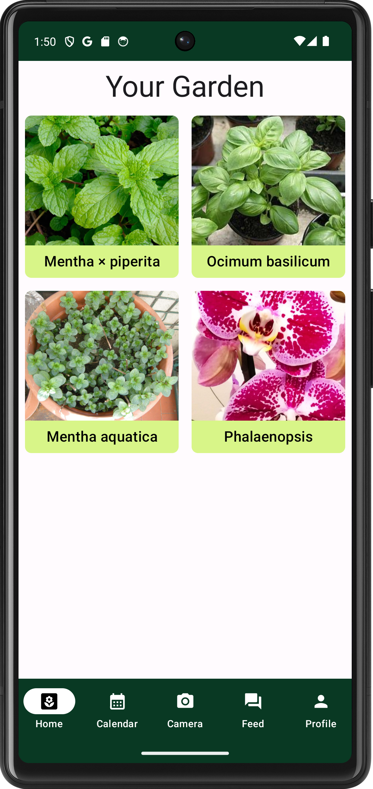
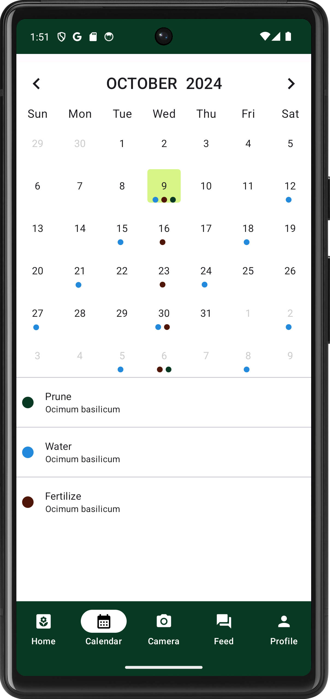
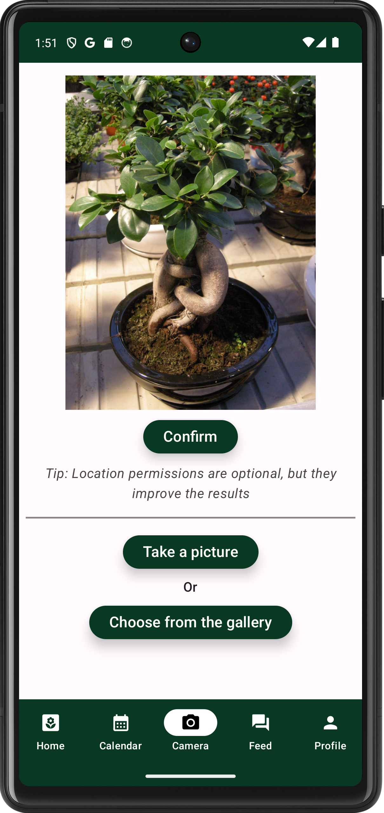
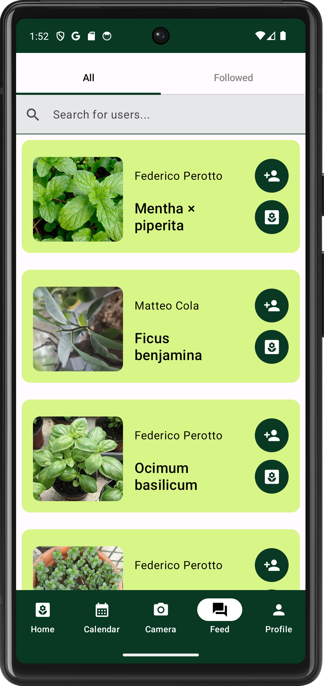

# WhatsThePlant
Developed for the course of Mobile Applications and Cloud Computing at Sapienza University

WhatsThePlant is a plant identification app that allows users to scan and recognize, and save information about plants using AI models. The users can save data about the plants for future reference and can set up plant caring tasks via a built-in calendar. The users can also access a list of plants identified by other users, and can access those informations as well as follow users they like.

## Features
- **Plant Identification**: Use your camera or photos in your gallery to have the Plant.id AI model return useful information about a plant.
- **Personal Gardens**: Save your identified plants in your personal garden.
-**Built-In Calendar**: Schedule and view your plant care tasks in a built-in Calendar.
- **Map Integration**: Allow GPS data to improve idenitification results and tag plant locations on a map.
-**Social Feed**:  Discover what plants other users have found, visit their gardens and follow those who you like.

## Tech Stack
- **Kotlin + Jetpack Compose**: To handle the app logic and UI.
- **Plant.id**: API to identify plants.
-  **Firebase**: Service used to handle sign ins and registrations of users, as well as storing data.
- **Mapbox**: Integrated for mapping and location services.
- **Retrofit**: For API calls to save and retrieve user data.
- **Python Flask**: Backend for custom API hosted on PythonAnywhere to handle plants and tasks.

## Examples
